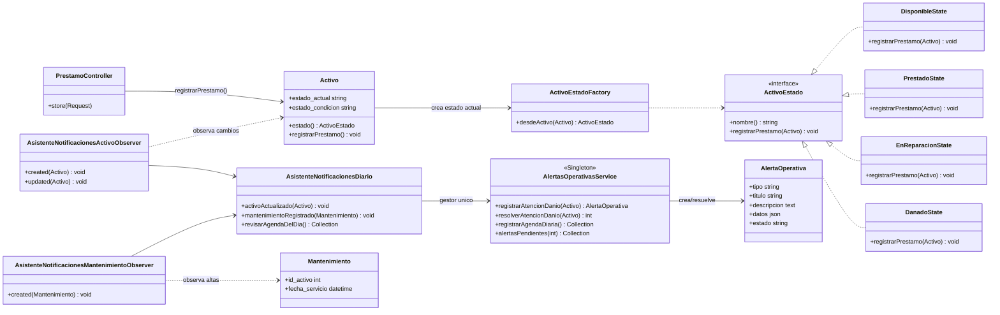

# CulturaGest - Patrones GoF aplicados

## Diagrama de clases UML

## Impacto arquitectonico

- **State** mueve la regla de prestamo al estado del activo. Si el activo esta en reparacion o danado, `registrarPrestamo()` bloquea la operacion automaticamente, sin duplicar condiciones en controladores.
- **Observer** desacopla el asistente de los flujos de pantalla. Cualquier cambio en `Activo` o alta de `Mantenimiento` dispara la evaluacion de alertas, aunque el cambio venga de un controlador, seeder, job o comando futuro.
- **Singleton** centraliza el control de avisos en `AlertasOperativasService`. Esto evita multiples estrategias de creacion de alertas y permite auditar en un solo lugar que mensajes se generan, actualizan o resuelven.
- La trazabilidad mejora porque cada alerta queda persistida con `tipo`, `id_activo`, `datos` y `fecha_alerta`; el personal puede reconstruir por que un bien cultural fue bloqueado, enviado a revision o propuesto para reemplazo.
- El mantenimiento preventivo mejora porque el sistema ya no depende solo de que alguien revise manualmente el inventario: el asistente registra alertas por dano/reparacion y agenda diaria de prestamos con devolucion prevista para hoy.
